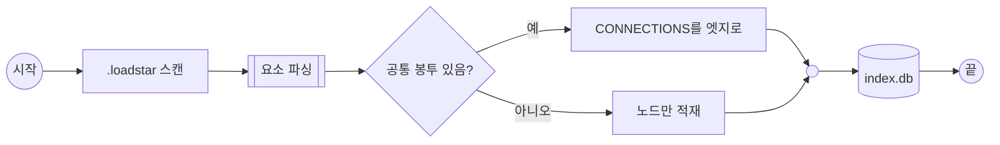

### IDENTITY
- SUMMARY: `.loadstar/` 요소 md가 구조 추출기를 거쳐 index.db로 들어가기까지의 전체 흐름

### CONNECTIONS
- PARENT: [WP][2.0][2026.07.27]구조 추출기.md
- REFERENCE: []

### DIAGRAM

### REFERENCES
- scan: [WP][2.0][2026.07.27]구조 추출기.md
- parse: [FLOW][2.0][2026.09.17]요소 파싱 상세.md
- edge: [DWP][2.0][2026.08.13]구조 추출기 edges 테이블.md
- db: [DWP][2.0][2026.08.13]구조 추출기 nodes 테이블.md

### ISSUE
- OTHER는 공통 봉투가 면제라(`02.ELEMENT_FORMAT.md` §6) `skip` 갈래로 빠진다 — 노드로는 색인되지만 엣지는 생기지 않는다.
