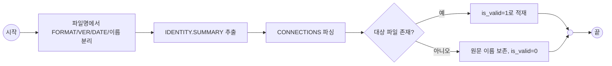

### IDENTITY
- SUMMARY: 색인 파이프라인의 "요소 파싱" 단계를 풀어 쓴 하위 흐름 — md 한 개에서 nodes/edges 레코드가 나오기까지

### CONNECTIONS
- PARENT: [FLOW][2.0][2026.09.17]색인 파이프라인.md
- REFERENCE: []

### DIAGRAM

### REFERENCES
- conn: [WP][2.0][2026.07.27]구조 추출기.md
- broken: [DWP][2.0][2026.08.13]구조 추출기 edges 테이블.md

### ISSUE
- 깨진 참조를 조용히 버리지 않고 남기는 이유는 검증기가 나중에 쓰기 위해서다 — 상세는 부모 WP의 COMMENT 참조.
