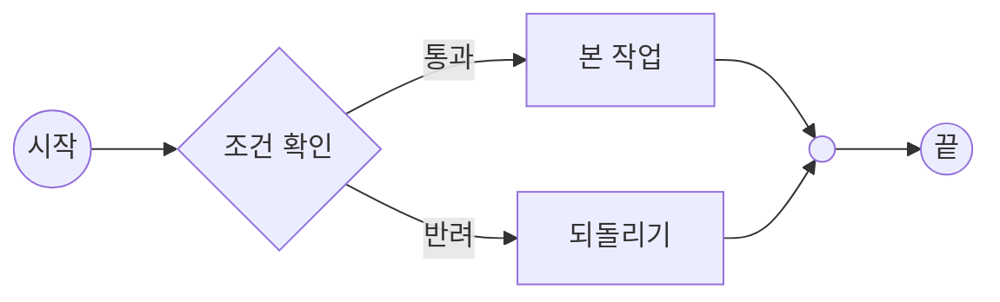

### IDENTITY
- SUMMARY: 펼침이 어떻게 그려지는지 보기 위한 하위 흐름 샘플 — 시작·끝은 펼칠 때 흡수되고, 가운데 갈래는 그대로 부모 그림 안에 들어온다

### CONNECTIONS
- PARENT: [FLOW][2.0][2026.09.17]구현절차[샘플].md
- REFERENCE: []

### DIAGRAM

### REFERENCES

### ISSUE
- 시작(`((시작))`)과 끝(`((끝))`)은 들어오는·나가는 화살표가 하나뿐이라 펼칠 때 흡수된다 — 부모 그림에서는 `조건 확인`이 입구, `out` 병합점이 출구가 된다.
