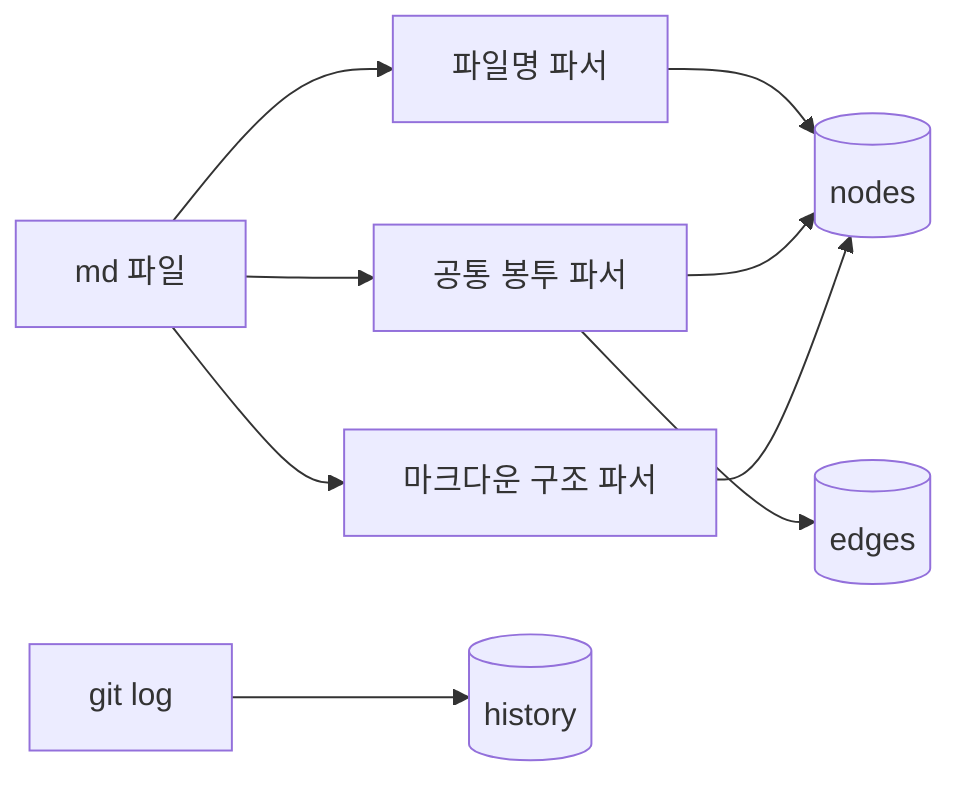

## [STATUS] S_IDL

### IDENTITY
- SUMMARY: md 파일에서 결정론적으로 문서 정체성·구조를 추출해 SQLite(nodes/edges/history)에 적재하는 파이프라인

### GOAL
FORMAT에 무관하게 파일명 필드(FORMAT/VER/DATE/이름) + IDENTITY.SUMMARY + CONNECTIONS + 마크다운 문법 차원의 구조적 사실(제목 대체값/목차/체크박스 개수)을 파싱해 nodes/edges 테이블에 적재한다. Git 커밋 로그를 파싱해 history 테이블도 채운다. 새 FORMAT(WP/DWP 외)이 추가돼도 이 추출기 자체는 수정될 필요가 없어야 한다.

### CONNECTIONS
- PARENT: [WP][2.0][2026.07.27]LOADSTAR 2.0 Standalone Viewer.md
- CHILDREN: []
- REFERENCE: []

### ATTACHMENTS
- https://github.com/openLoadstar/spec/blob/main/SPEC%202.0/04.META_EXTRACTION.md — §4, §6 스키마·역할 정의

### TODO
# TASK
- [ ] 파일명 파서 — `[FORMAT][VER][DATE]이름.md` 정규식 파싱 (구조화 필드가 앞에 몰려있어 `이름`은 마지막 `]` 뒤부터 `.md` 전까지로 단순 추출)
- [ ] 공통 봉투 파서 — IDENTITY.SUMMARY, CONNECTIONS(PARENT/CHILDREN/REFERENCE)
- [ ] 마크다운 구조 파서 — 첫 헤딩/줄(title 대체), 헤딩 목차(toc), 체크박스 개수(checklist_total/done)
- [ ] SQLite 스키마 마이그레이션 — nodes, edges, history 테이블 (`04.META_EXTRACTION.md §6.1~6.3`)
- [ ] git log 파싱 → history 테이블 적재
- [ ] nodes.modified_at을 git 마지막 커밋 시각으로 채우기
- [ ] 재실행 시 기존 데이터 재생성(파생 캐시 원칙 검증) — 전체 재색인 커맨드
- [ ] `.loadstar/.cache/index.db` 생성 위치 확정, 프로젝트 `.gitignore`에 등록되는지 확인

### ISSUE
- 트리거 방식 미정 — 파일 변경 감지 vs 주기 실행 vs git post-commit hook.
- Validator(깨진 참조·PARENT/CHILDREN 교차검증·동명 충돌 검사)를 이 추출기에 결합할지 독립 실행할지 미정.
- TODO 아카이브 파일(`appendix/WP.md` "TODO 아카이브 규칙" 참조)을 이 추출기가 어떻게 다룰지 — 새 파일명 규칙에서는 일반 WP와 구분 안 됨. appendix 쪽 결정 대기 중.

### COMMENT

