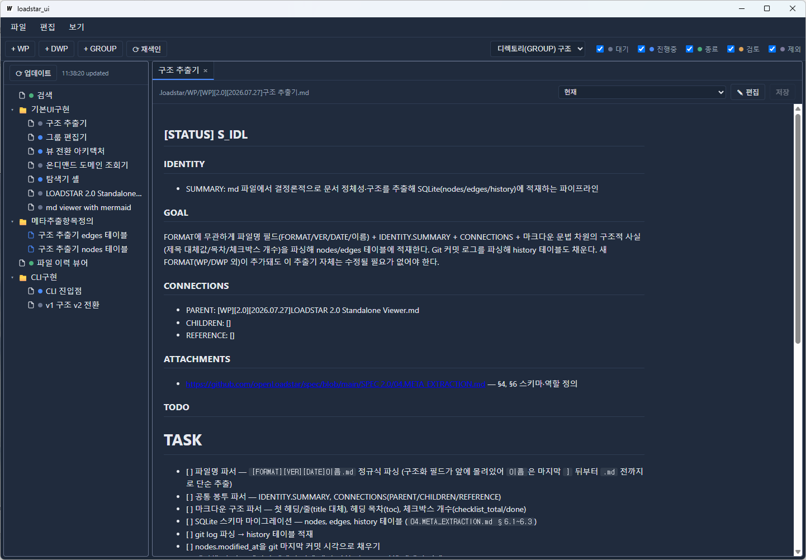
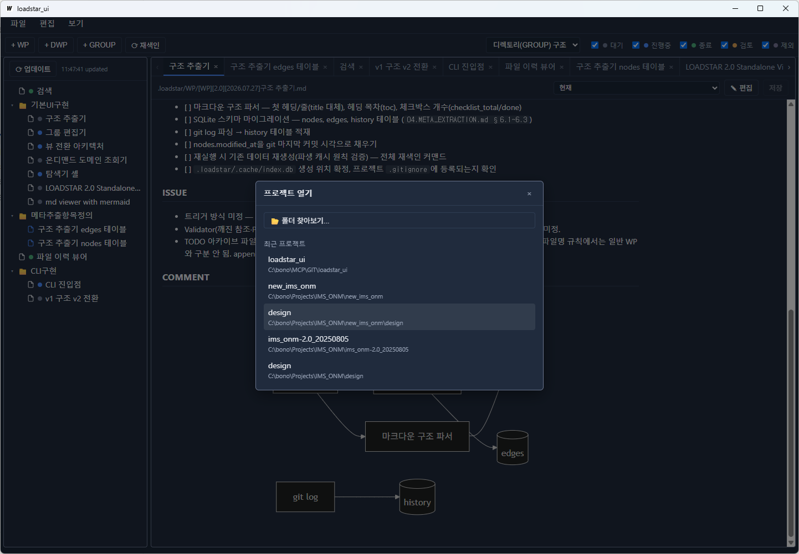
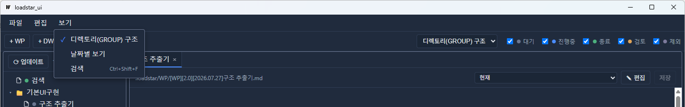
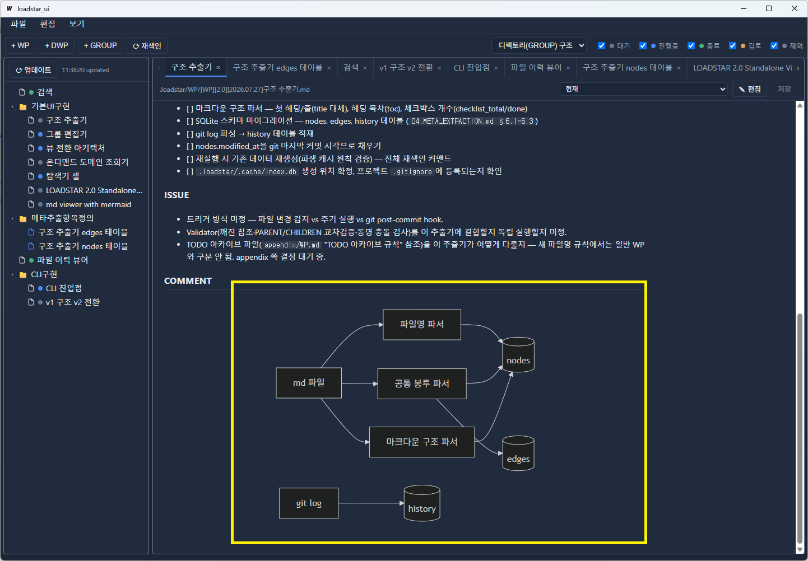
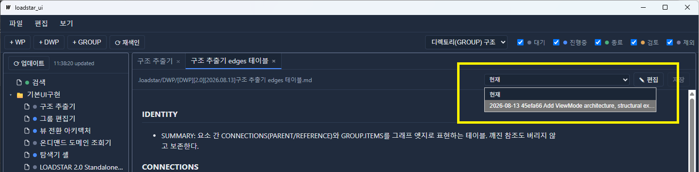
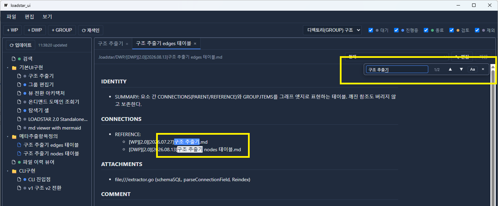
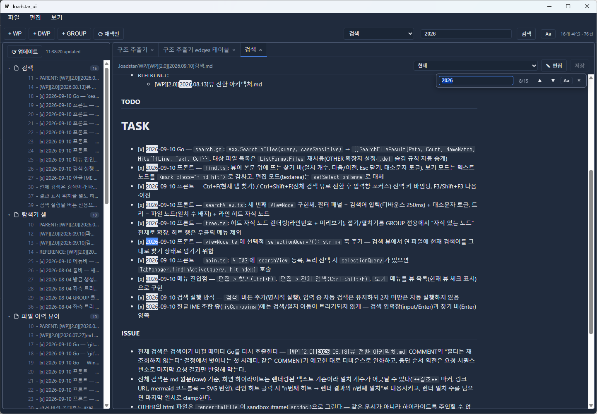
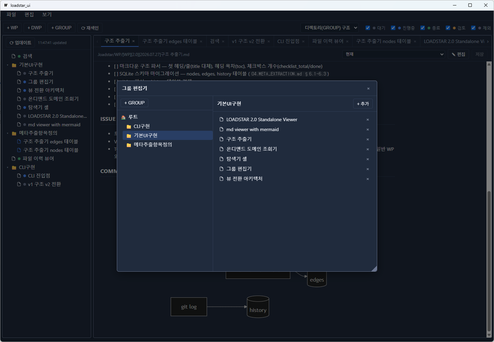

> 🌐 **[English](README.md)** | **한국어**

# LOADSTAR Explorer UI

[LOADSTAR 2.0](https://github.com/openLoadstar/spec/tree/main/SPEC%202.0) 프로젝트를 위한 standalone 데스크톱 탐색기/편집기입니다. 프로젝트의 `.loadstar/` 요소 파일을 트리로 훑고, 렌더링된 상태로 읽고(Mermaid 다이어그램 포함), 편집하고, git 이력을 되짚고, 전체 파일을 검색합니다. 단일 실행 파일 + OS 네이티브 웹뷰 — 띄울 서버가 없습니다.



> 📌 LOADSTAR가 처음이라면 먼저 [openLoadstar 전체 안내](https://github.com/openLoadstar/openLoadstar) 와 [spec 2.0 설계](https://github.com/openLoadstar/spec/tree/main/SPEC%202.0) 를 참고하세요.

---

## 🧭 스택

| 레이어 | 스택 |
|:---|:---|
| 앱 셸 | Go 1.25 + [Wails v2](https://wails.io) (OS 네이티브 웹뷰, 브라우저 엔진 번들 없음) |
| 프론트엔드 | TypeScript + Vite, UI 프레임워크 없음 |
| 렌더링 | [markdown-it](https://github.com/markdown-it/markdown-it) + [Mermaid.js](https://mermaid.js.org) — 웹뷰 안에서 실시간 렌더링 |
| 인덱스 | [modernc.org/sqlite](https://pkg.go.dev/modernc.org/sqlite) 기반 SQLite (순수 Go, cgo 불필요) |
| 이력 | `PATH`에 이미 있는 `git` 실행 파일 (별도 라이브러리 의존 없음) |

## 🚀 빌드 & 실행

```bash
wails build          # -> build/bin/loadstar.exe
wails dev            # 라이브 리로드 개발 빌드
```

같은 바이너리가 GUI이자 CLI입니다. 인자 없이 실행하면 창이 뜨고, 서브커맨드를 주면 콘솔에서 동작합니다.

---

## ✨ 기능

### 프로젝트 열기

`.loadstar/` 디렉토리가 있는 폴더면 무엇이든 열 수 있습니다. 최근 연 프로젝트는 시작 화면과 **파일 > 프로젝트 열기** 대화상자에 모두 남아, 프로젝트 전환은 클릭 한 번입니다.



### 같은 프로젝트를 보는 세 가지 관점

좌측 트리는 프로젝트를 보는 *관점*이며, **보기** 메뉴나 툴바 드롭다운에서 갈아끼웁니다.



| 뷰 | 보여주는 것 |
|:---|:---|
| **디렉토리(GROUP) 구조** | `GROUP.ITEMS`를 재귀적으로 풀어 만든 GROUP 계층. 어느 GROUP에도 속하지 않은 요소는 루트에 그대로 나옵니다. WP 행에는 STATUS 색상 점이 붙고, 툴바 필터로 상태별로 숨기거나 보일 수 있습니다. |
| **날짜별 보기** | WP/DWP/GROUP/OTHER/FLOW 전체를 최신순 평면 목록으로, 시작/종료 날짜 필터와 함께. |
| **검색** | 전체 파일 검색 결과 — 아래 참조. |

### 마크다운 + Mermaid 뷰어와 편집기

`.md` 요소는 서식이 적용된 문서로 렌더링되고, ` ```mermaid ` 블록은 실제 다이어그램으로 그려집니다. **✎ 편집**을 누르면 원본 마크다운을 그대로 다루는 텍스트 에디터로 바뀝니다. 저장 시에는 경량 형식 검사(부록 스펙 기준 `IDENTITY` / `SUMMARY` / `CONNECTIONS` / `STATUS` 섹션 존재 여부)를 돌려, 걸리는 게 있으면 저장 여부를 먼저 묻습니다.

OTHER는 타입별로 다르게 다룹니다 — `.csv` / `.json` / `.txt`는 마크다운 문법에 오인식돼 원문이 깨지지 않도록 그대로 보여주고, 자기완결형 `.html`은 sandbox iframe으로 렌더링합니다. GROUP 탭은 편집 대신 정보 뷰입니다: 멤버 목록을 클릭 가능한 링크로 보여주고, 그룹명과 멤버를 평문으로 클립보드에 담는 "복사" 버튼이 있습니다.



### 흐름도 — `FLOW` 요소

`FLOW` 요소는 처리 과정을 mermaid 그림 한 장으로 기술하고, 각 노드가 어떤 WP / DWP / 다른 FLOW를 가리키는지 함께 적습니다. 프로젝트 전체 흐름을 한 파일에 두고, 풀어 써야 할 단계는 그 단계를 별도 FLOW로 만들어 서브루틴 상자로 그립니다 — 함수 호출과 같은 모양이고, 그게 요점입니다.

그림은 `### DIAGRAM` 안의 순수 mermaid라 마크다운이 렌더되는 곳이면 어디서든(GitHub 포함) 그대로 그려집니다. 노드와 요소의 연결은 코드블록 **밖**의 `### REFERENCES`에 있어서, 구조 추출기와 검증기가 관계를 계속 볼 수 있습니다. 보기 모드에서는 요소가 연결된 노드에 테두리가 생기고 누르면 그 요소가 탭으로 열립니다. **✎ 그림 편집**으로 바꾸면 같은 그림이 편집기가 됩니다 — 노드를 골라 id·라벨·종류를 바꾸고, 앞이나 뒤에 새 단계를 끼워 넣고, 지우고(앞뒤는 자동으로 이어집니다), 요소를 연결합니다. 그 노드에 붙은 화살표도 목록으로 나와서, 분기에 세 번째 갈래를 내거나, 한 갈래에만 단계를 더 넣거나, 조건 라벨을 그 자리에서 고칠 수 있습니다. 추가는 방향이 아니라 결과로 나뉩니다 — **병렬 추가**는 갈래를 하나 더 내고, **삽입 추가**는 기존 갈래를 새 단계 뒤로 밉니다. 노드를 다른 노드 뒤로 **이동**시킬 수도 있습니다. mermaid를 직접 칠 일이 없습니다. 모든 변경은 고쳐야 할 줄만 고치고, `Ctrl+Z`로 되돌릴 수 있으며, 편집기가 안전하게 다룰 수 없는 문법이 섞인 그림은 망가뜨리는 대신 구조 편집을 잠급니다. 도형에는 의미가 고정돼 있습니다 — `[단계]`, `{분기}`, `(( ))` 병합, `[[하위 흐름]]`, `[(저장소)]`, `((시작·끝))`. 자세한 내용은 [appendix/FLOW.md](https://github.com/openLoadstar/spec/blob/main/SPEC%202.0/appendix/FLOW.md).

### 파일별 git 이력

모든 요소 탭에 버전 콤보박스가 붙습니다. 커밋을 고르면 그 시점 내용이 읽기 전용으로 렌더링되고, **현재**로 돌아오면 작업 중이던 내용이 그대로 복구됩니다(과거 버전을 보는 동안 저장 안 한 편집 내용은 보존됩니다). `git log --follow`로 리네임을 따라가므로, LOADSTAR가 쓰는 이름변경·`.del` 방식에도 이력이 끊기지 않습니다. git이 없거나, git 저장소가 아니거나, 아직 커밋된 적 없는 파일이면 **이력 없음**으로 표시되고 비활성화됩니다.



### 열린 문서 안에서 찾기 — `Ctrl+F`

모든 일치 항목을 반전 색으로, 현재 항목은 accent 색으로 표시하고, 일치 개수와 다음/이전 이동(`Enter` / `Shift+Enter`, `F3` / `Shift+F3`)을 제공합니다. 편집 모드에서도 동작하며, Mermaid 다이어그램 내부 텍스트는 건드리지 않습니다.



### 전체 파일 검색 — `Ctrl+Shift+F`

이클립스 스타일 결과 목록입니다 — 일치한 파일과 일치 수, 펼치면 해당 라인들. 라인을 클릭하면 그 파일이 열리며 정확히 그 위치로 이동해 키워드가 하이라이트됩니다. 검색 버튼이나 `Enter`로 실행하고, 두 글자부터는 입력 중에도 자동 검색합니다(디바운스 적용, IME 조합이 끝난 뒤에만 실행 — 한글을 자모 단위로 검색하지 않습니다).



### 요소 생성·이름변경·삭제

**+ WP** / **+ DWP** / **+ FLOW**는 스펙 형태로 스캐폴딩한 파일을 만들고 바로 편집 모드로 엽니다. 한 번도 저장하지 않은 채 닫으면 삭제할지 물어보므로, 이름을 잘못 친 빈 파일이 프로젝트에 남지 않습니다. 트리 행을 우클릭하면 이름변경(`[FORMAT][VER][DATE]` 접두어는 유지하고 라벨만 교체)과 삭제를 할 수 있습니다. "삭제"는 파일을 지우는 대신 `.del`을 덧붙입니다 — 트리에서만 사라지고, 탐색기에서 확장자만 떼면 되돌아옵니다. 이름을 바꾸면 그 파일이 속한 모든 GROUP의 `ITEMS`도 함께 갱신됩니다.

### 그룹 편집기

GROUP 계층을 만들고, 각 그룹의 `ITEMS`를 마크다운 직접 편집 대신 목록 UI로 관리합니다.



### 구조 추출기(재색인)

**⟳ 재색인**은 `.loadstar/`를 훑어 `.loadstar/.cache/index.db`(`04.META_EXTRACTION.md`의 `nodes` / `edges`)를 재생성합니다. 깨진 참조는 조용히 버리지 않고 원본 대상 이름과 `is_valid` 플래그로 남겨, 나중에 검증기가 보고할 수 있게 합니다.

### OTHER 확장자 필터

OTHER는 `[FORMAT][VER][DATE]이름.md` 명명 규칙이 면제되는 유일한 FORMAT이라 어떤 확장자든 들어올 수 있습니다. **편집 > OTHER 확장자 설정**에서 트리에 보여줄 확장자를 고릅니다. 목록은 기본 프리셋에 현재 프로젝트에 실제로 존재하는 확장자를 합쳐서 보여줍니다.

### CLI

```
loadstar                           GUI 실행
loadstar create <FORMAT> "이름"     WP/DWP/GROUP/FLOW 파일 생성 (wp|dwp|group|flow)
loadstar show                      STATUS별 분포 + ISSUE 있는 문서 요약
loadstar reindex                   .loadstar/.cache/index.db 재생성
```

GUI와 CLI는 스캐폴딩·색인 로직을 그대로 공유하므로 두 경로가 어긋날 일이 없습니다.

---

## ⌨️ 단축키

| 키 | 동작 |
|:---|:---|
| `Ctrl+F` | 열린 문서 안에서 찾기 |
| `Ctrl+Shift+F` | 전체 파일 검색 |
| `Enter` / `Shift+Enter` | 다음 / 이전 일치 (찾기 입력창에서) |
| `F3` / `Shift+F3` | 다음 / 이전 일치 (어디서나) |
| `Esc` | 찾기 바 닫기 |

## 📁 파일 위치

```
<프로젝트>/
└── .loadstar/
    ├── WP/  DWP/  GROUP/  OTHER/  FLOW/    요소 파일
    └── .cache/index.db               추출기 산출물 (git 제외)

%AppData%\loadstar\
├── recent_projects.json  recent_files.json
├── other_extensions.json
└── loadstar-debug.log
```

사용자 데이터를 exe 옆이 아니라 `%AppData%`에 두는 이유: exe는 쓰기 권한이 없는 위치에 있을 수 있고, 이 데이터는 특정 바이너리 사본이나 특정 프로젝트가 아니라 사용자에게 속하기 때문입니다.

## 🛠 개발

이 저장소는 스스로를 LOADSTAR로 관리합니다 — 위 기능들의 작업 항목이 전부 `.loadstar/WP/`에 있고, WayPoint 우선 워크플로(무엇을 할지 먼저 기록하고 착수)는 `CLAUDE.md`에 정리돼 있습니다.

## 📄 License

[Apache License 2.0](./LICENSE)
